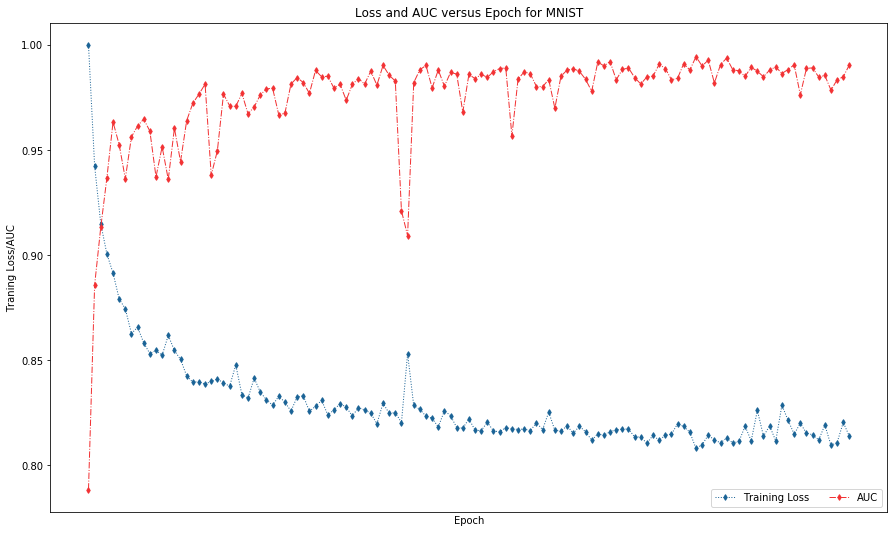
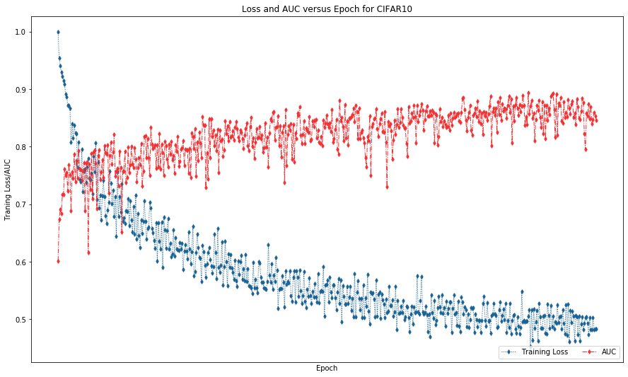
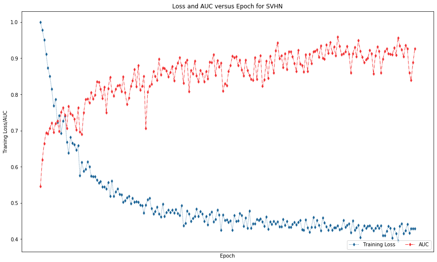

# PyTorch implementation of EULAC
This is a reproducing code for the deep part of experiment in EULAC in the paper "**An Unbiased Risk Estimator for Learning with Augmented Classes**".

* ```main.py``` is an example code of EULAC. 

## Datasets descriptions

The CIFAR10 dataset has total 39000 training samples. Total number of labels are 10, while we randomly select 6 of them as known class and other classes are treated as new class. Training samples consists of 30000 labeled samples, 5000 for each of the known classes, and 9000 unlabeled samples, 900 for all 10 classes. The test set includes 1000 samples, 100 for each of all 10 classes.

Similar to CIFAR10, the statics of other datasets in our experiment as well as their splits are shown as the following table.

- | Dataset                                    | MNIST | CIFAR-10 | SVHN  |
  | ------------------------------------------ | ----- | -------- | ----- |
  | Number of known classes                    | 6     | 6        | 6     |
  | Number of labeled samples for each class   | 6000  | 5000     | 4500  |
  | Total number of labeled samples            | 36000 | 30000    | 27000 |
  | Number of true labels of unlabeled data    | 10    | 10       | 10    |
  | Number of unlabeled samples for each class | 1000  | 900      | 3000  |
  | Total number of unlabeled samples          | 10000 | 9000     | 30000 |
  | Total number of training samples           | 46000 | 39000    | 57000 |
  | Number of true labels in test set          | 10    | 10       | 10    |
  | Number of test samples per class           | 100   | 100      | 100   |
  | Total number of test samples               | 1000  | 1000     | 1000  |
  
- An example of datasets are shown in './dataset' path. Refer 'train.txt' and 'val.txt' in each dataset's corresponding folder for details.

## Experiment Environment
* Python 3.7
* Torch = 1.4.0
* If using GPU, Cuda >= 9.2

## Quick start
You can run an example code of CIFAR10 for the performance of EULAC in turns of AUC on GPU.

    python main.py --dataset CIFAR10

You can see additional options by adding ```--help```.

## Result




On average EULAC achieves better performance on AUC than known contenders.

## Parameters

Our implement also includes argparse options, refer **main.py** to see full and default argparse settings for parameters.